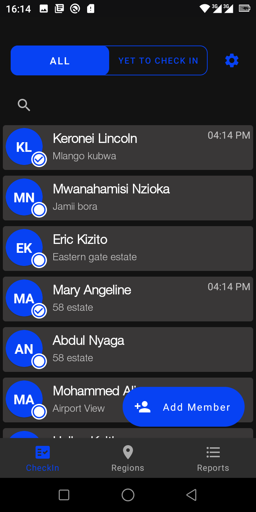

# Keros Checkin
An app to simplify check in process for periodical sessions where particulars such as temperature are required to be recorded.

## Screenshots
  

see more in [screenshots folder](screenshots/)

## To run
You will need a `google-services.json` file
    - for integrating firebase services, this should be placed in app/
    - get one in [firebase](https://firebase.google.com/) by creating a project.

## Languages, libraries and tools used

* [Kotlin](https://kotlinlang.org/)
* Android Support Libraries
* [Hilt](https://dagger.dev/hilt/)
* [Timber](https://github.com/JakeWharton/timber)
* [Espresso](https://developer.android.com/training/testing/espresso/index.html)
* [Apache POI](https://poi.apache.org/), [download here](http://www.java2s.com/Code/Jar/p/Downloadpoi37jar.htm)
* [Applock](https://github.com/mattsilber/applock)
* [Sweet alerts](https://github.com/pedant/sweet-alert-dialog)

